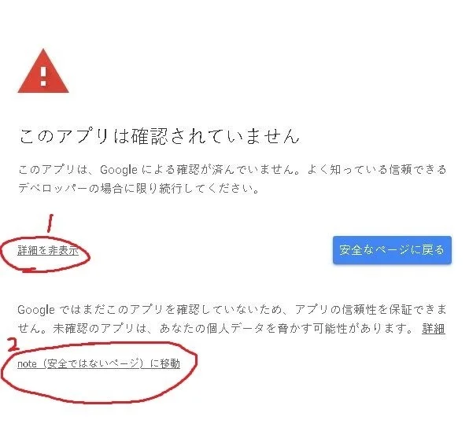

# discord-nbot-free-server-template

**サーバーなし、Glitch と Google Apps Script (GAS) を使用しよう :D**

## 初めに

**仕様:**  
このコードでは discord.js を使用しています。

このテンプレートを使用すると、[Glitch](https://glitch.com) にて Discord Bot を実行。[Google Apps Script](https://workspace.google.co.jp)（通称 GAS）から POST することで起動状態を維持し、実質的なサーバーレスの機能を利用できます。以下の手順に従って、ボットの設定を行ってください。

### 1. Glitch の設定

1. [Glitch](https://glitch.com) にアクセスし、サインインまたは新しいアカウントを作成します。
2. "New Project" をクリックし、"Import From GitHub" を選択します。
3. リポジトリの URL: `https://github.com/nezumi0627/discord-nbot-free-server-template` を入力し、「OK」をクリックします。

### 2. Google script(workspace) の設定

1. [Google script](https://workspace.google.co.jp) にアクセス、サインインまたは新しいアカウントを作成します。
2. "+新しいプロジェクト" ボタンをクリックし、新しい Google Apps Script プロジェクトを作成します。
3. [コード.gs](https://github.com/nezumi0627/discord-nbot-free-server-template/blob/main/コード.gs)のコードをスクリプトエディタにコピーして貼り付けます。
4. デプロイアイコン（ロケット）をクリックし、「New deployment」を選択してスクリプトをウェブアプリとしてデプロイします。
5. トリガーから、トリガー➔タイマー➔トリガーを追加 を開く。
6. 
   - 実行する関数を選択: `wakeGlitch`
   - 実行するデプロイを選択: `触らない`
   - イベントのソースを選択: `触らない`
   - 時間ベースのトリガーのタイプを選択: `分ベースのタイマー`（時間の間隔: `5分おき`）
   
   にし、保存。

   

### 3. Discord 開発者ポータル

1. [Discord 開発者ポータル](https://discord.com/developers) を訪れて、サインインまたは新しいアカウントを作成します。
2. 新しいアプリケーションを作成し、ボットを追加します。
3. ボットトークンをコピーし、Glitch プロジェクトの環境変数として設定します(.envファイルを作成し、入れてください)。

## 使用方法

1. コード内の設定を更新して、サーバーレスの機能に Google Apps Script の URL を使用します。
2. Glitch で Discord ボットを起動します。
3. Discord 上でボットと対話します。
4. 最後に、必ず各サービスの制作陣、関係者、それとねずみに感謝します。

このテンプレートをベースにして、ボットのニーズに合わせて自由にカスタマイズしてください。

---

解説を参考にさせていただいたサイト: [誰でも作れる！Discord Bot（基礎編）](https://note.com/exteoi/n/nf1c37cb26c41)
